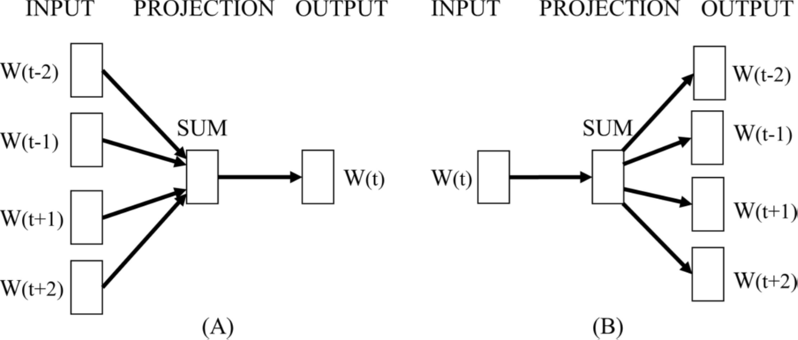
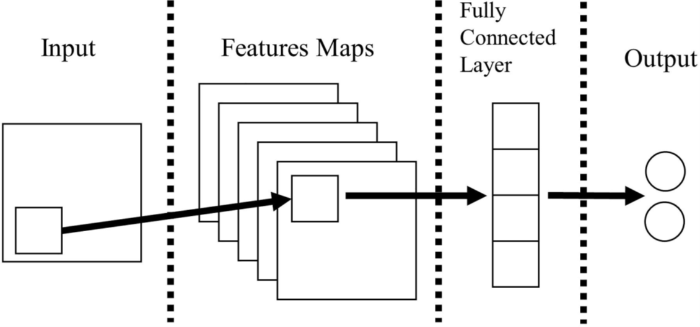
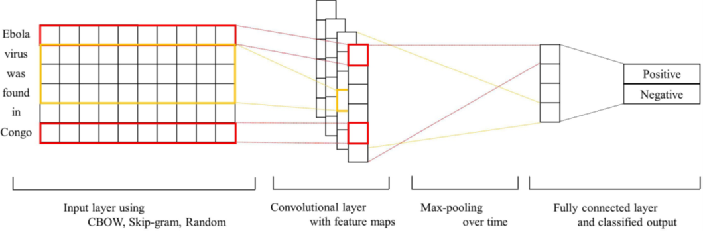
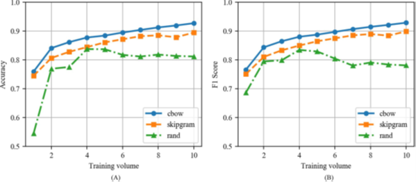
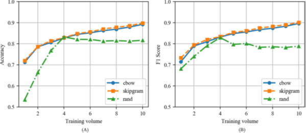

# Word2vec-CNN for sentence classification

## Motivation
 - 키워드를 기반으로 수집된 웹 데이터는 의도와는 다르게 광고성 혹은 무의미한 내용을 가진 데이터를 분류하지 못함
 - Convolutional Neural Network (CNN)은 문장 분류에서 우수한 성능을 보임 [[1]](https://arxiv.org/pdf/1408.5882.pdf).
 - Word2vec은 문장 분류를 위한 CNN의 성능을 향상시키지만 word2vec의 두 가지 학습 방법(Skip-gram, CBOW)에 따른 성능 실험 연구는 부족함.

## Background Knowledge
### Word2vec

Word2vec은 문서 내 단어들 사이의 의미론적 유사성을 반영하여 각 단어에 vector를 부여하는 기술이다. (A) CBOW는 인접한 단어들이 등장했을 때 목표 단어가 등장할 확률을 기반으로 vector를 조정하고, (B) Skip-gram은 목표 단어가 등장했을 때 인접 단어가 등장할 확률을 기반으로 vector를 조정한다.

### CNN

CNN은 2차원 또는 3차원 데이터가 주어졌을 때, 공간적 데이터의 손실을 최소화 하면서 1차원 데이터로 변환한 뒤 학습하는 모델 구조를 갖는다. 위 그림과 같이 (n, n) 크기의 kernel을 이동시키면서 데이터를 pooling 하여 더 작은 차원으로 mapping한다. 이 과정을 반복함으로써, 데이터의 차원을 감소시킬 때 공간적 데이터의 손실을 최소화 한다.

## Model

위 그림은 word2vec-CNN 모델 구조를 나타낸다. 예문으로 사용한 'Ebola virus was found in Congo'는 각 단어 별로 쪼개지고(['Ebola', 'virus', ..., 'Congo']) word2vec에 의해 각 단어에 부여된 벡터 값이 convolutional layer로 입력된다. 이후, max-pooling 과정을 거쳐 fully-connected layer로 입력되고 모델은 해당 문장이 필요한 문장(Positive)인지 불필요한 문장(Negative)인지 분류한다.

## Experiment
### Data
| Type | Value |
| -----  | ----- |
| 수집 기간 | 18.03.01 - 18.05.01 (62 days) |
| 종류 | 네이버 뉴스, 트위터 |
| 수집 기준 | 질병 관련 키워드 |
| 크기 | 뉴스(468 MB), 트윗 (713 MB)

### Result
#### News
 

네이버 뉴스를 학습한 모델들의 성능을 비교한 그림이다. CBOW, Skip-gram, Random vector를 사용한 CNN 모델들의 성능을 Accuracy 와 F1 Score를 사용해 평가했다.
#### Twitter

트위터를 학습한 모델들의 성능을 비교한 그림이다. CBOW, Skip-gram, Random vector를 사용한 CNN 모델들의 성능을 Accuracy 와 F1 Score를 사용해 평가했다.

## Conclusion
- Word2vec을 사용한 CNN모델은 Random vector를 사용한 모델보다 좋은 성능을 보였다.
- CBOW-CNN 모델은 뉴스 분류에서 Accuracy 기준 .9341, F1 Score 기준 .9351 의 성능으로 뉴스 분류에서 더 좋은 성능을 보였다.
- Skip-gram-CNN 모델은 트위터 분류에서 Accuracy 기준 .9081, F1 Score 기준 .9097 의 성능으로 트위터 분류에서 더 좋은 성능을 보였다.

## References
[1] Kim, Yoon. "Convolutional neural networks for sentence classification." _arXiv preprint arXiv:1408.5882_ (2014).